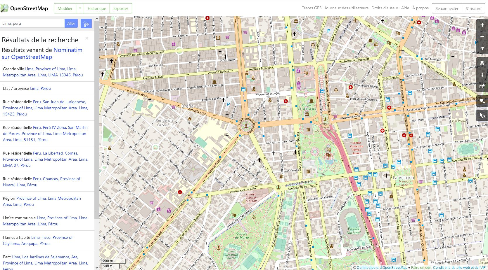
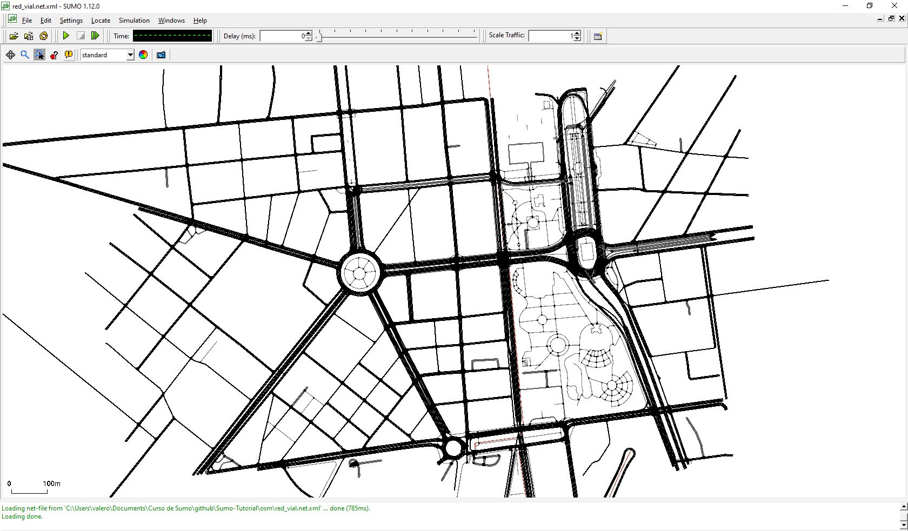

Sumo Tutorial
==============

**Table of contents**
1. [Introduction](#introduction)
1. [Installation](#installation)
1. [Assignment 1: Hello SUMO](#assignment-1:-hello-sumo)
1. [Obtaining transport network from osm](#obtaining-transport-network-from-osm)
1. [Traci](#traci)

 

# Introduction
SUMO, [Simulation of Urban MObility](http://sumo.dlr.de/index.html), is an open source, microscopic, multi-modal traffic simulation tool, which is created by the Institute of Transportation Systems of the German Aerospace Center(DLR). SUMO is purely microscopic: each vehicle is modeled specifically, has its own trajectory and moves individually in the network with SUMO, for example:  
- You can build the network and create routes.
- You can apply a traffic light algorithm.
- You can analyze your simulation result with SUMO.
All its documentations can be found in this [link](http://sumo.dlr.de/wiki).

Before starting doing the assignments and download SUMO packages, create a folder in local memory particularly only for this Tutorial.

# Installation

We need SUMO and Python for this Tutorial.

## Installation of SUMO
SUMO can be installed in Windows, Linux, as well as in Mac-OS. Follow the notices in this  [link](https://www.eclipse.org/sumo/)

## Installation of Anaconda
Anaconda is an open source python platform. Download and install Anaconda for Python 3 version : [Link Anaconda](https://www.anaconda.com/products/distribution).

# Assignment 1: Hello SUMO
This exercise aims at understanding SUMO how we can generate and simulate a traffic scenario.

A SUMO scenario is principally composed of a map (a street network) and traffics (vehicles and their routes). A map could be a real part of city map or a manual created map, represented like a network which consists of nodes (junctions) and edges (streets connecting the junctions). In order to put traffics on a map, we need give the information including the vehicle type, the vehicle trajectory, the number of vehicles.

In this hello assignment, we will simulate a simple scenario. Before doing all steps of this simulation, we create a folder named ’hello’ in the TP folder where we will put all pieces of files.

Note that SUMO read a set of .xml files to do the simulation, composed of information of streets, vehicles, and the traffics and declared as attributes in the corresponding .xml file. In this assignment, we need follow the steps:
- Creation of node file : .nod.xml
- Creation of edge file : .edg.xml
- Creation of network from node file and edge file : .net.xml
- Creation of traffic demands : .rou.xml
- Simulation scenario with SUMO-GUI : .sumocfg

## Generation of SUMO streets network
A network is composed of streets which are structurally built of nodes and edges. A street is composed of at least two nodes and one edge.

Let’s create the first SUMO network :
### Step 1
Create the node file named ”hello/hello.nod.xml”. It contains 2 nodes, in which all nodes are defined by its coordinates (x, y, describing distance to the origin in meters ) and its unique ID name:
```xml
<nodes>
    <node id="1" x="-300.0" y="0.0" />
    <node id="2" x="+300.0" y="0.0" />
</nodes>
```

### Step 2
Then, create the edges file named ”hello/hello.edg.xml”. Note that each edge is unidirectional, directing from one node ID to another node ID. We can define also the number of lanes that the edge has.

```xml
<edges>
    <edge from="1" id="1to2" to="2" numLanes="3"/>
    <edge from="2" id="2to1" to="1" numLanes="2"/>
</edges>
```

### Step 3
Now that we have nodes and edges, we can use a SUMO tool, NETCONVERT, which is used for combining nodes information and edges information, and generating network file where the vehicles can run along. This file is ended by an extention *.net.xml.
Use command lines in following steps to call NETCONVERT and create the network file :

### Step 4 
Open windows command-line interpreter (type CMD in windows research) and go to your folder repertory by the command line : 
```$ cd path_to_folder ```

### Step 5
Create the network file by the command in a line: ```$ netconvert --node-files=hello.nod.xml --edge-files=hello.edg.xml --output-file=hello.net.xml ```

### Step 6
We can find this application(sumo-gui.exe) in the search of windows. Use the ”Open Network” in ”File”bmenu to import the network.

For more information, you can find the SUMO-GUI Usage Description in the link : Usage Description.

### Step 7
Create a route file named ”hello.rou.xml” file:
```xml
<routes>
    <vType accel="1.0" decel="5.0" id="Car" length="2.0" maxSpeed="100.0" sigma="0.0" />
    <route id="route0" edges="1to2 2to1"/>
    <vehicle depart="1" id="veh0" route="route0" type="Car" />
</routes>
```
### Step 8 
Until now, we have all elements for the scenario. Then we need to create a SUMO configuration file and give it a name like ’hello.sumocfg’:
- input to all related .xml file
- indicate the simulation time in second
```xml
<configuration>
    <input>
        <net-file value="hello.net.xml"/>
        <route-files value="hello.rou.xml"/>
    </input>
    <time>
        <begin value="0"/>
        <end value="10000"/>
    </time>
</configuration>
```
### Step 9
Open the configuration file by SUMO-GUI to see the simulation. Using either the ”Open Simulation” in ”File” menu or by using the ”open”-icon, you can load ”hello.sumocfg”. It is better to give a delay for the simulation in order to seeing vehicles’ behavior.

Description of SUMO-GUI : Usage Description

### Step 10
Create numbers of vehicles in the file hello.rou.xml, for example:
```xml
<routes>
    <vType accel="1.0" decel="5.0" id="Car" length="5.0" minGap="2.0" maxSpeed="50.0" sigma="0"/>
    <route id="route1" edges="1to2" />
    <route id="route2" edges="2to1" />
    <vehicle id="veh1" depart="0" route="route1" type="Car" />
    <flow id="flow1" begin="0" end="10" vehsPerHour="10000" route="route2" type="Car" />
</routes>
```
## Advanced Hello
We have learned how to simulate a scenario in SUMO.

### Step 11
We could define a lane which is absolutely restricted to buses on the map. 
1. Modify a lane information in hello.net.xml. Add ”vClass” parameter (List of vClass) which defines only the specific type of vehicles can run in this lane.
A example of modifying 2to1 0 lane in the file hello.net.xml generated by NET-CONVERT :
```xml
...
    <lane id="2to1_0" index="0" speed="13.89" length="600.00" vClass = ’bus’ shape="600.00,4.80 0.00,4.80"/>
...
```
Note that 2to1 0 lane is one lane of 2to1 edge which we created in edge file.
2. Then, we can add some buses in the hello.rou.xml file.
A example for the new hello.rou.xml :
```xml
<routes>
  <vType accel="1.0" decel="5.0" id="Car" length="5.0" minGap="2.0" maxSpeed="50.0" sigma="0" />
  <vType accel="1.0" decel="5.0" id="Bus" length="10.0" minGap="2.0" maxSpeed="40.0" sigma="0" vClass="bus" />
  <route id="route1" edges="1to2" />
  <route id="route2" edges="2to1" />
  <vehicle id="veh1" depart="0" route="route1" type="Car" />
  <vehicle id="veh2" depart="0" route="route2" type="Bus" />
  <vehicle id="veh3" depart="2" route="route2" type="Bus" />
  <flow id="flow1" begin="2" end="10" vehsPerHour="10000" route="route2" type="Car" />
</routes>
```
Note that ```<vType>``` has vClass = ’passenger’ by default if not given.
# Obtaining transport network from osm
## Step 1
In SUMO we can import a transportation network from openstreetmap and then input demand data.

## Step 2
Convert .osm file to .net file by the command in a line: ```$netconvert --osm-files Plaza_Bolognesi.osm -o red_vial.net.xml```
## Step 3
We can visualize the network with sumo_gui in File/Open Network


# Simulation with Real network (OpenStreetMap)
In this assignment, we will use a real network of Paris (l’Arc de Triomphe and Champs Elysée) : paris.net.xml. Routes are generated randomly by the tool randomTrips.py.
Once the simulation has finished, we can find two files generated, which we declared in the configuration file as outputs of the simulation:
- tripInfo.xml, contains every vehicle’s information.
- Summary.xml, contains a global summary for every time step
Simulation configuration file : paris.sumocfg
```xml
<configuration> 
	<input>
		<net-file value="paris.net.xml"/>
		<route-files value="paris.rou.xml"/> 
		<gui-settings-file value="network.settings.xml"/>
	</input> 
	<output>
		<tripinfo-output value="tripinfo.xml"/>
		<summary-output value="summary.xml"/> 
		</output> <time> <begin value="0"/> 
		<end value="3650"/> 
	</time> 
</configuration
```
## Analysis of simulation results
### Step 1
In this step, we will analyze traffic results of the simulation. The most interesting file we use here is the tripinfo.xml file, who has all time and speed information for each vehicle.
1. In SUMO packages, a script xml2csv.py is given to convert a xml file to scv, which is located in : `C:\Program Files (x86)\Eclipse\Sumo\tools\xml`.
Let’s convert tripinfo.xml to tripinfo.csv. Command in one line:
```$C:\Program Files (x86)\Eclipse\Sumo\tools\xml\xml2csv.py <input_file>```

# Traci
In this section, we will use a tool Traci, written on Python, which can communicate into a running simulation and allow us to get information and to control the traffic elements’ behavior.
## Step 1
Open python file `osm_paris/run_paris`and execute in anaconda. Try to understand the code.